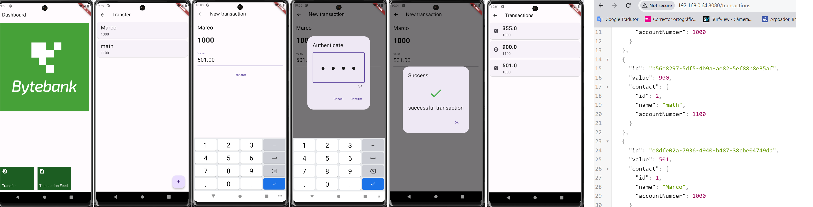

  
# Bytebank App

## Introdução


Este projeto é fruto do curso de 'Testes de unidade e Widget com Mocks:boas práticas no Flutter' da plataforma ALURA

## Descrição do Projeto

O Bytebank App é um aplicativo para gerenciamento de transações financeiras, permitindo aos usuários cadastrar contatos e realizar transações entre eles. O aplicativo foi desenvolvido para fins de teste, utilizando tanto dados mock quanto acessos de API para diferentes funcionalidades.



## Estrutura do Projeto

- **Cadastro de Contatos**: O cadastro de contatos é realizado localmente, utilizando um banco de dados SQLite. Isso permite que os dados de contato sejam acessados e gerenciados diretamente no dispositivo, facilitando o desenvolvimento e teste de funcionalidades offline.

- **Transações**: As transações financeiras são gerenciadas através de um servidor Node.js. Esta abordagem foi escolhida para simular um ambiente real de API, onde as transações são enviadas e recebidas através de chamadas HTTP. Isso permite testar a integração com serviços externos e a manipulação de dados em um cenário mais próximo ao de produção. Vale notar que as transações não são persistidas em um banco de dados no servidor; em vez disso, são mantidas em um array temporário. Portanto, quando o servidor é reiniciado, todas as transações são perdidas.

## Uso do Servidor Node.js

### Testes com Mock e API

O principal objetivo do Bytebank App é fornecer um ambiente de teste robusto para desenvolvedores. Para alcançar isso, adotamos a seguinte abordagem:

- **Mock de Dados**: Algumas partes do aplicativo, como o cadastro de contatos, utilizam dados mock armazenados localmente. Isso facilita o desenvolvimento e testes rápidos sem a necessidade de um backend ativo.
- **Acessos de API**: Para simular um cenário real de uso, a funcionalidade de transações é gerenciada através de um servidor Node.js. O servidor simula uma API RESTful, permitindo que os desenvolvedores testem a integração do aplicativo com serviços externos e verifiquem o comportamento das transações em um ambiente de rede.

### Benefícios

1. **Ambiente de Teste Realista**: Utilizando um servidor Node.js para as transações, é possível testar o fluxo completo de envio, recebimento e manipulação de dados através de uma API, simulando um ambiente de produção.
2. **Flexibilidade no Desenvolvimento**: A combinação de dados mock locais e acessos de API permite flexibilidade no desenvolvimento, facilitando testes isolados de diferentes partes do aplicativo.
3. **Simulação de Integração**: A utilização de um servidor para as transações permite testar a integração do aplicativo com serviços externos, verificando a resposta do sistema a diferentes cenários de rede e manipulação de dados.
4. **Persistência Temporária**: As transações são armazenadas temporariamente em um array no servidor Node.js. Portanto, quando o servidor é reiniciado, todas as transações são perdidas, o que reforça o objetivo de testar o comportamento do aplicativo em um ambiente dinâmico e volátil.

## Como Executar o Projeto

### Configuração do Servidor Node.js

1. Clone o repositório:
   ```bash
   git clone https://github.com/msbzz/flutter-tests-unit-widgets
   ```
2. Navegue até o diretório do servidor:
   ```bash
   cd flutter-tests-unit-widgets/server
   ```
3. Instale as dependências:
   ```bash
   npm install
   ```
4. Inicie o servidor:
   ```bash
   node server.js
   ```

### Executando o Aplicativo Flutter

1. Navegue até o diretório do aplicativo Flutter:
   ```bash
   cd flutter-tests-unit-widgets
   ```
2. Instale as dependências:
   ```bash
   flutter pub get
   ```
3. Execute o aplicativo:
   ```bash
   flutter run
   ```
 
 
